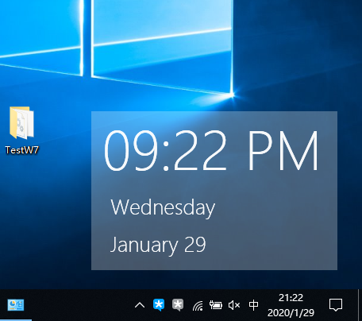

# Widget-WPF

一个简单轻松的时钟控件。  
An easy time widget for Windows 10.

**If you want to read English version README, click [here](#widget-wpf-english-version-readme).**

## 特性

- Win+D组合键不会隐藏*
- 简约轻松，本体只有750KiB**
- 与Windows 10完美结合
- 支持GPU-3D渲染***
- 绿色无广告
- 我编不下去了

\* 此功能在Win 10之前版本不适用  
\*\* 仅包含Json支持库以及主程序，其中Json支持库占用约685KiB  
\*\*\* 仅主界面

## 使用需求

- Windows 10以及以上版本*
- .NET Framework 4.7.2

\* Windows 7以及部分版本仍可运行，但是由于存在轻微兼容性问题不被推荐**  
\*\* 运行时会被提示警告

## 截屏

# Widget-WPF English Version README

## Feature

- Will not be hiden when using Win+D*
- Easy, pure, the main body has only 750KiB**
- Work well with Windows 10
- GPU-3D supported***
- Clean withoout ADs
- Wubba lubba dub dub!

\* This feature will not work on the system which earlier than Windows 10   
\*\* Only include Json support library and main program. And the size of Json support library is about 685KiB  
\*\*\* MainWindow only

## Needed

- Windows 10 or later Windows system*
- .NET Framework 4.7.2

\* May works on Windows 7 or other version of Windows. But not be recommended beacuse that there are some problems**  
\*\* Will alert when runs

## Screenshots

Look on [截图](#截屏)